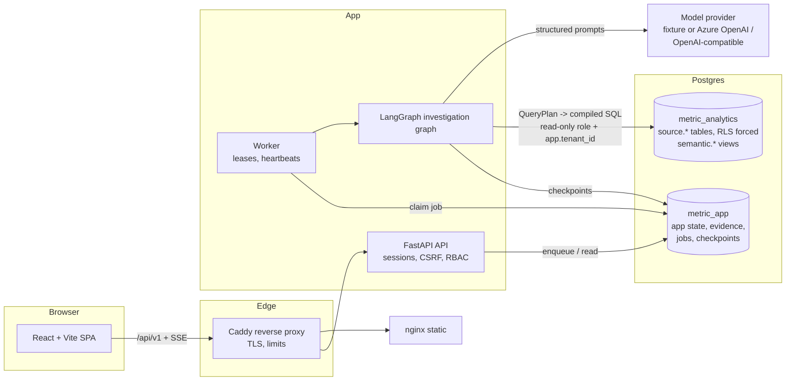
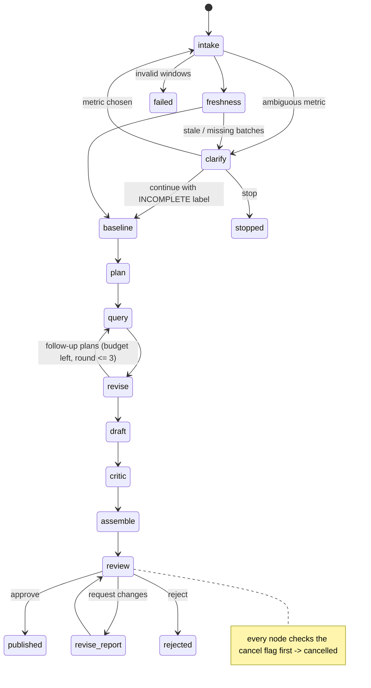

# Architecture

Metric Investigator answers "why did this metric change?" with a bounded agent that can only query
data through validated plans and can only publish numbers that deterministic code has recomputed
from stored evidence. A human reviewer approves every published report.

## Components



| Directory | Responsibility |
|---|---|
| `backend/app/api` | Routes, request schemas, errors, middleware (rate limit, body size, security headers). Thin: business rules live in `services/`. |
| `backend/app/auth` | Argon2id hashing, server-side sessions, CSRF, OIDC seam (`oidc.py`). |
| `backend/app/metrics` | Versioned semantic catalog, windows, vetted Decimal calculations, noise band. |
| `backend/app/tools` | `QueryPlan` schema, validator and SQLAlchemy compiler; typed tools with audit events. |
| `backend/app/evidence` | Append-only evidence ledger and the deterministic claim verifier. |
| `backend/app/agents` | Graph state, nodes, routing, role prompts, runtime/budget accounting. |
| `backend/app/providers` | Provider interface, deterministic fixture provider, Azure/OpenAI-compatible adapter. |
| `backend/app/workers` | Postgres job queue (SKIP LOCKED, leases, fencing tokens) and worker process. |
| `backend/app/evals` | Scenario families, ground truth, three-system comparison, report writer. |
| `backend/app/seed` | Deterministic synthetic data generator, loader, bootstrap. |
| `frontend/src` | SPA pages: sign-in, overview, new investigation, detail, evidence explorer, review, catalog, data quality, admin. |
| `infra/` | Postgres role bootstrap, Caddyfile. `compose.yaml` / `compose.prod.yaml` at the root. |

## Boundaries: model reasoning vs deterministic code vs human review

| Decision | Who decides |
|---|---|
| Which metric an ambiguous word means | **Human** (clarification interrupt). Code never guesses for "revenue"/"sales". |
| Windows, timezone, as-of, freshness | **Code** (`metrics/windows.py`, freshness tool). |
| Which hypotheses to test, which QueryPlans to propose | **Model (analyst role)**. |
| Whether a plan may run, and the SQL it becomes | **Code**: Pydantic `extra=forbid`, catalog validation, allowlisted compiler, budget checks. |
| Who can see what data | **Database** (RLS forced, read-only role) + **code** (tenant predicate, membership checks). |
| All arithmetic (deltas, contributions, price/volume, noise band) | **Code** (`metrics/calculations.py`). |
| Wording of findings, hypothesis statuses | **Model (analyst)**. |
| Whether a claim's numbers are right | **Code** (`evidence/verification.py`). An LLM judge is never the only check. |
| Contradictions, confounders, causal overreach | **Model (critic role)** + **code** causal-language rule. |
| Publication | **Human reviewer** (not the owner). |

## Investigation graph and state transitions



Investigation `status` values: `queued → running → (awaiting_clarification ↔ running) → awaiting_review → completed | rejected`,
plus `cancelled`, `failed`, `insufficient_evidence` (analyst chose to stop on incomplete data).

**State** (`agents/graph.py: InvestigationState`) holds ids, metric contract, windows, freshness/quality facts,
headline/components/noise band, per-hypothesis result summaries, pending plans, round, budget flags, draft
summary and driver, critic findings, report version. It never holds chain-of-thought: only structured data and
short rationales, which are also written to `investigation_steps`.

**Durability.** LangGraph `PostgresSaver` stores a checkpoint after every node (`durability="sync"`), keyed by
`thread_id = investigation id`. The worker re-invokes the same thread after a crash and execution continues from
the last checkpoint. Side effects are idempotent: query runs are keyed by `operation_id = investigation:plan_hash`,
so re-executed nodes reuse evidence, and a retry of an interrupted query is not charged twice
(see `docs/evidence_restart_recovery.txt`).

**Budgets.** ≤ 8 hypotheses, ≤ 12 source queries, ≤ 2 repair attempts per invalid plan, a step budget (40) and a
model-cost ceiling (`MAX_RUN_COST`). On exhaustion the graph assembles a partial report labelled `PARTIAL REPORT`.
Transient model/DB errors are retried with bounded backoff; a repair that returns the same plan is not re-run.

## Tool contracts

Every tool validates a Pydantic input, returns structured data, is time- and size-bounded and writes a
`tool_call` event (`tools/registry.py`).

| Tool | Input | Output | Notes |
|---|---|---|---|
| `get_metric_definition` | `metric_key` | active definition JSON | tenant-scoped |
| `get_source_freshness` | `baseline_start`, `current_end` | watermark, stale flag, missing batch days, evidence id | fixed template over `semantic.ingestion_status` |
| `propose_query_plan` | raw plan, hypothesis key, attempt | valid flag, canonical plan, plan hash, issues | stores a `query_plans` row either way |
| `execute_approved_plan` | plan record id, plan, label | evidence id, rows, reused flag | re-validates, compiles, charges budget, reuses identical plans |
| `calculate_delta` | totals evidence id | delta, components, price/volume (calculation evidence) | exact Decimal |
| `decompose_by_dimension` | dimension + totals evidence ids | contributions (+ rate/mix for ratios) | reconciles to total |
| `compare_hypothesis` | hypothesis key, evidence id, analysis | bounded summary for the model | top-10 segments |
| `attach_evidence` | hypothesis key, evidence ids | count | only evidence of the same investigation |
| `assemble_report` | (node `assemble`) | report version | built from verified claims only |

### QueryPlan

```json
{
  "metric_id": "net_sales", "metric_version": 1,
  "analysis": "by_dimension",            // totals | by_dimension | daily | history | campaign_spend | quality
  "baseline_window": {"start": "2026-08-18", "end": "2026-08-25"},
  "current_window":  {"start": "2026-08-25", "end": "2026-09-01"},
  "dimension": "region",
  "filters": [{"dimension": "channel", "values": ["web"]}],
  "order_by": "segment", "limit": 20, "lookback_periods": 0,
  "purpose": "free text, stored, never compiled"
}
```

There is no field that can carry SQL, functions, joins, subqueries or expressions (`extra="forbid"`). Dimensions
and filter values are checked against the catalog, windows must equal the investigation windows, and the compiler
maps catalog names to allowlisted columns of the `semantic` views; all values are bound parameters.

## Data dictionary (source, `metric_analytics`)

All tables carry `tenant_id uuid` and have RLS **enabled and forced**. Money is `numeric(14,2)`, timestamps are `timestamptz` (UTC), currency is explicit.

| Table | Key columns | Notes |
|---|---|---|
| `source.customers` | `customer_id`, `source_id`, `region`, `segment` | identifiers never exposed through views |
| `source.products` | `product_id`, `sku`, `category`, `list_price` | 5 categories × 8 products |
| `source.orders` | `order_id`, `source_id`, `ordered_at` (nullable in the missing-values scenario), `status` (completed/canceled), `channel`, `region`, `discount_amount`, `tax_amount`, `shipping_amount`, `campaign_id`, `batch_id`, `ingested_at` | duplicates share `source_id` |
| `source.order_items` | `order_item_id`, `order_id`, `product_id`, `quantity`, `unit_price` | |
| `source.refunds` | `refund_id`, `order_id`, `amount`, `refunded_at`, `reason`, `batch_id` | partial and late-arriving refunds |
| `source.campaigns` / `campaign_daily_spend` | `campaign_id`, `channel`, `spend_date`, `amount` | |
| `source.ingestion_batches` | `batch_id`, `source_table`, `covers_date`, `row_count`, `watermark` | one batch per table per local day |

Approved views (`semantic.*`, the only objects the query role can read): `order_facts` (order grain, items
pre-aggregated with a LATERAL subquery), `order_category_facts` (order × category grain), `refund_facts`,
`campaign_spend`, `ingestion_status`.

Application tables (`metric_app`): tenants, users, memberships, sessions, connections, metric_definitions,
investigations, investigation_steps, hypotheses, query_plans, query_runs, evidence_items (append-only trigger),
claims, reports, report_versions, approvals, jobs, worker_heartbeats, audit_events, eval_suites, eval_runs, plus
LangGraph checkpoint tables. `tenant_id` is immutable on investigation-related tables (trigger).

## Metric catalog

See [METRIC_CATALOG.md](METRIC_CATALOG.md).
